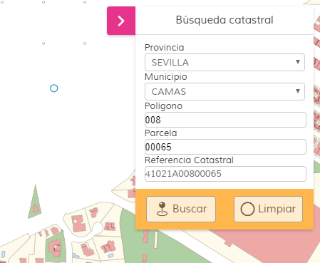

# Catastro search

[](https://github.com/sigcorporativo-ja/Mapea4-dev-webpack)  

## Descripción

 Plugin de [Mapea](https://github.com/sigcorporativo-ja/Mapea4) desarrollado por el [Instituto de Estadística y Cartografía](https://www.juntadeandalucia.es/institutodeestadisticaycartografia) para la búsqueda de elementos catastrales, haciendo uso de los servicios web de [Catastro](http://www.catastro.meh.es/ws/Webservices_Libres.pdf)

 Se puede realizar la búsqueda tanto por polígono y parcela, indicando previamente la provincia y el municipio, así como indicando directamente la referencia catastral.

 Si la búsqueda es satisfactoria, centrará el mapa en la posición de la parcela y hará zoom a dicha posición.

 

 
## Recursos y uso

- js: catastrosearch.ol.min.js
- css: catastrosearch.min.css

```javascript
// crear el plugin
var mp = new M.plugin.CatastroSearch();

// añadirlo al mapa
myMap.addPlugin(mp);
});
```  